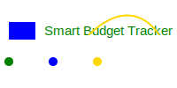

<div align="center">
  
</div>

# Smart Budget Tracker

An intelligent personal finance management application built with TypeScript, React, and powered by Google's Generative AI (Gemini). Track your expenses, manage budgets, and gain AI-driven insights into your financial health.

## Features

✨ **Smart Expense Tracking** - Easily log and categorize your daily expenses
📊 **Visual Analytics** - Beautiful charts and graphs to understand your spending patterns  
🤖 **AI-Powered Insights** - Get personalized financial recommendations using Gemini AI
💾 **Data Export** - Export your financial data to PDF, Excel, and other formats
🔐 **Secure Storage** - Your data is securely stored with Firebase/Supabase integration
📱 **Responsive Design** - Works seamlessly on desktop and mobile devices

## Tech Stack

- **Frontend**: React 19 + TypeScript
- **Styling**: Lucide React Icons
- **Data Visualization**: Recharts
- **State Management**: React Router
- **Backend Services**: Firebase & Supabase
- **AI Integration**: Google Generative AI (Gemini)
- **Export Tools**: jsPDF, XLSX
- **Build Tool**: Vite

## Run Locally

**Prerequisites:**  Node.js

1. Clone the repository:
   ```bash
   git clone https://github.com/sarashakya6/smart-budget-tracker.git
   cd smart-budget-tracker
   ```

2. Install dependencies:
   ```bash
   npm install
   ```

3. Set up environment variables in `.env.local`:
   ```
   VITE_GEMINI_API_KEY=your_gemini_api_key_here
   VITE_FIREBASE_API_KEY=your_firebase_key_here
   VITE_SUPABASE_URL=your_supabase_url_here
   VITE_SUPABASE_ANON_KEY=your_supabase_key_here
   ```

4. Run the development server:
   ```bash
   npm run dev
   ```

5. Open your browser and navigate to `http://localhost:5173`

## Build

To create a production build:

```bash
npm run build
```

Preview the production build:

```bash
npm run preview
```

## Live Demo

View your app in AI Studio: https://ai.studio/apps/drive/1uOuDA_oGtOzboagTIjTs6ekxA8HXXGaA

## Project Structure

```
smart-budget-tracker/
├── src/
│   ├── components/       # React components
│   ├── pages/           # Page components
│   ├── services/        # API and AI services
│   ├── utils/           # Utility functions
│   ├── App.tsx          # Main app component
│   └── main.tsx         # Entry point
├── public/              # Static assets
├── package.json         # Dependencies
└── vite.config.ts       # Vite configuration
```

## License

This project is open source and available under the MIT License.

## Contributing

Contributions are welcome! Please feel free to submit a Pull Request.

## Support

For support, please open an issue on GitHub.

---

Made with ❤️ by Sarah Shakya